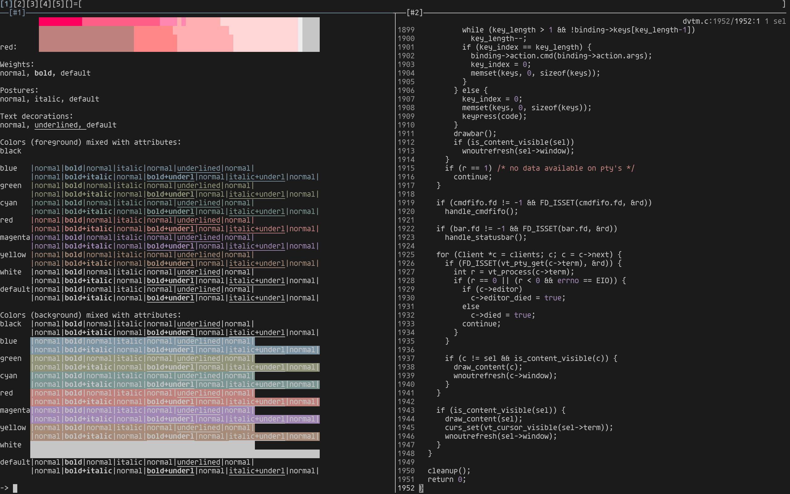
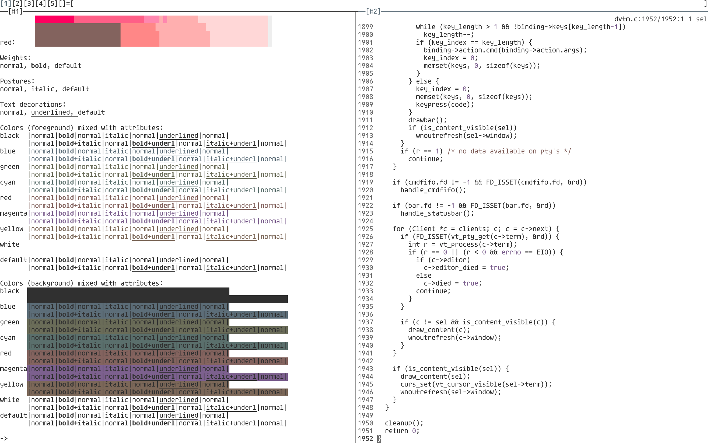

# theme

Light and dark colorscheme for use with terminals. Inspired by
[Tomorrow](https://github.com/chriskempson/tomorrow-theme),
[Alabaster](https://github.com/tonsky/sublime-scheme-alabaster), and
[Cemant](https://github.com/blobject/cemant).

## colors

Colors were chosen using the
[L\*a\*b\*](https://en.wikipedia.org/wiki/CIELAB_color_space) color space.

### dark

| name    | image                    | hex      | L*  | a* | b* |
|---------|--------------------------|----------|-----|----|----|
| black   |    | `1b1b1b` |  10 |  0 |  0 |
| red     |      | `ab8983` |  60 | 12 |  8 |
| green   |    | `8f937b` |  60 | -6 | 12 |
| yellow  |   | `a38c7c` |  60 |  6 | 12 |
| blue    |     | `899297` |  60 | -2 | -4 |
| magenta |  | `a68991` |  60 | 12 |  0 |
| cyan    |     | `899390` |  60 | -4 |  0 |
| white   |    | `c6c6c6` |  80 |  0 |  0 |
| grey    |     | `919191` |  60 |  0 |  0 |

### light

| name    | image                    | hex      | L*  | a* | b* |
|---------|--------------------------|----------|-----|----|----|
| black   |    | `303030` |  20 |  0 |  0 |
| red     |      | `83635e` |  45 | 12 |  8 |
| green   |    | `686d56` |  45 | -6 | 12 |
| yellow  |   | `7c6657` |  45 |  6 | 12 |
| blue    |     | `636c71` |  45 | -2 | -4 |
| magenta |  | `7e646b` |  45 | 12 |  0 |
| cyan    |     | `636c6a` |  45 | -4 |  0 |
| white   |    | `ffffff` | 100 |  0 |  0 |
| grey    |     | `6a6a6a` |  45 |  0 |  0 |

## screenshots

