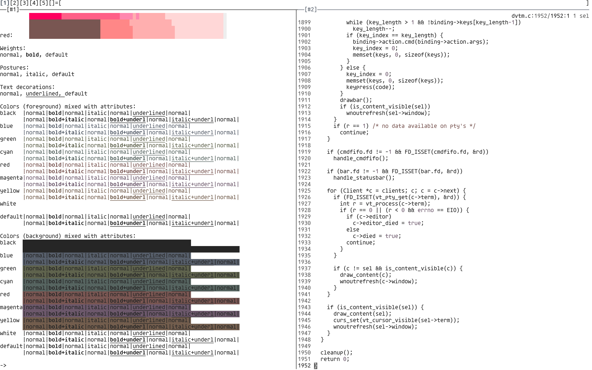

# theme

Light and dark colorscheme for use with terminals. Inspired by
[Tomorrow](https://github.com/chriskempson/tomorrow-theme),
[Alabaster](https://github.com/tonsky/sublime-scheme-alabaster), and
[Cemant](https://github.com/blobject/cemant).

## colors

Colors were chosen using the CIELAB color space.

## screenshots

