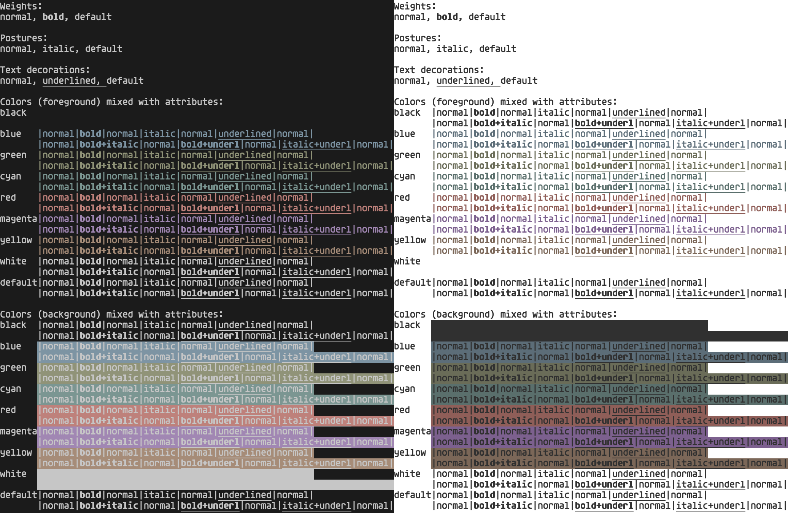
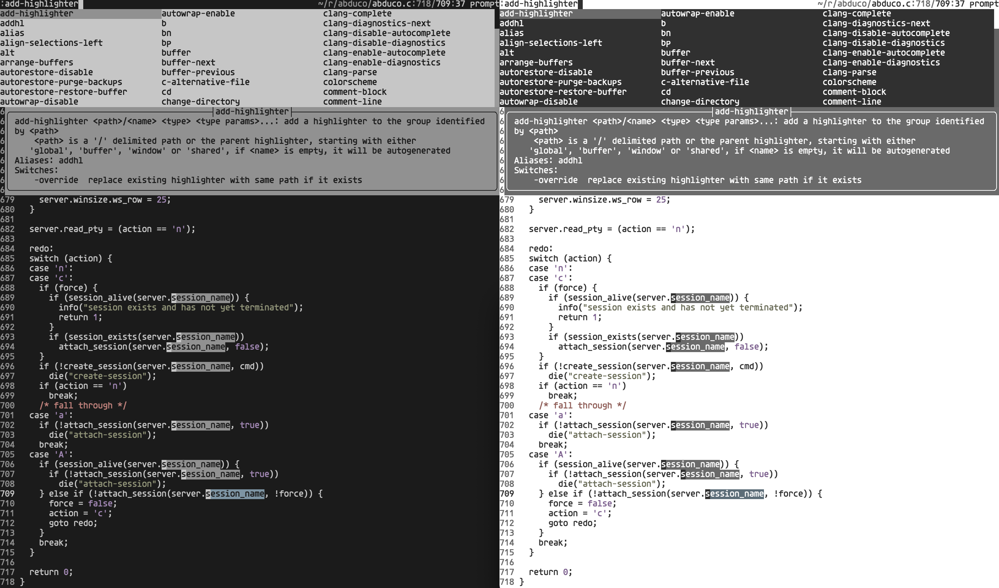

# theme

Light and dark colorscheme for use with terminals. Inspired by [Tomorrow](https://github.com/chriskempson/tomorrow-theme), [Alabaster](https://github.com/tonsky/sublime-scheme-alabaster), and [Cemant](https://github.com/blobject/cemant).

## colors

Colors were chosen using the [HSLuv](https://www.hsluv.org/) color space.

### dark

| name    | image                    | hex      | H     | S    | L     |
|---------|--------------------------|----------|-------|------|-------|
| black   |    | `1b1b1b` |   0.0 |  0.0 |  10.0 |
| red     |      | `be817b` |  18.0 | 30.0 |  60.0 |
| green   |    | `909378` |  90.0 | 30.0 |  60.0 |
| yellow  |   | `a68c78` |  45.0 | 30.0 |  60.0 |
| blue    |     | `7d94a3` | 230.0 | 30.0 |  60.0 |
| magenta |  | `a187b3` | 290.0 | 30.0 |  60.0 |
| cyan    |     | `7b9692` | 180.0 | 30.0 |  60.0 |
| white   |    | `c6c6c6` |   0.0 |  0.0 |  80.0 |
| grey    |     | `919191` |   0.0 |  0.0 |  60.0 |

### light

| name    | image                    | hex      | H     | S    | L     |
|---------|--------------------------|----------|-------|------|-------|
| black   |    | `303030` |   0.0 |  0.0 |  20.0 |
| red     |      | `8f5e58` |  18.0 | 30.0 |  45.0 |
| green   |    | `6a6c58` |  90.0 | 30.0 |  45.0 |
| yellow  |   | `7b6758` |  45.0 | 30.0 |  45.0 |
| blue    |     | `5c6d78` | 230.0 | 30.0 |  45.0 |
| magenta |  | `7c608e` | 290.0 | 30.0 |  45.0 |
| cyan    |     | `5a6f6c` | 180.0 | 30.0 |  45.0 |
| white   |    | `ffffff` |   0.0 |  0.0 | 100.0 |
| grey    |     | `6a6a6a` |   0.0 |  0.0 |  45.0 |

## screenshots

