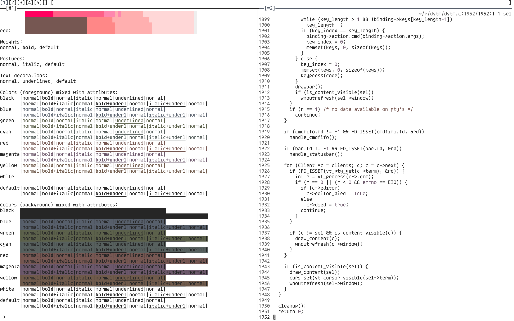

# theme

Light and dark colorscheme for use with terminals. Inspired by
[Tomorrow](https://github.com/chriskempson/tomorrow-theme),
[Alabaster](https://github.com/tonsky/sublime-scheme-alabaster), and
[Cemant](https://github.com/blobject/cemant).

## colors

Colors were chosen using the
[L\*a\*b\*](https://en.wikipedia.org/wiki/CIELAB_color_space) color space.

### dark

| name    | image                    | hex      | L\* | a\* | b\* |
|---------|--------------------------|----------|-----|-----|-----|
| black   |    | `1b1b1b` |  10 |   0 |   0 |
| red     |      | `ab8983` |  60 |  12 |   8 |
| green   |    | `8f937b` |  60 |  -6 |  12 |
| yellow  |   | `a38c7c` |  60 |   6 |  12 |
| blue    |     | `89919e` |  60 |   0 |  -8 |
| magenta |  | `a08a9f` |  60 |  12 |  -8 |
| cyan    |     | `899390` |  60 |  -4 |   0 |
| white   |    | `c6c6c6` |  80 |   0 |   0 |
| grey    |     | `919191` |  60 |   0 |   0 |

### light

| name    | image                    | hex      | L\* | a\* | b\* |
|---------|--------------------------|----------|-----|-----|-----|
| black   |    | `262626` |  15 |   0 |   0 |
| red     |      | `765752` |  40 |  12 |   8 |
| green   |    | `5c614b` |  40 |  -6 |  12 |
| yellow  |   | `6f5a4b` |  40 |   6 |  12 |
| blue    |     | `575f6b` |  40 |   0 |  -8 |
| magenta |  | `6c586b` |  40 |  12 |  -8 |
| cyan    |     | `57605e` |  40 |  -4 |   0 |
| white   |    | `ffffff` | 100 |   0 |   0 |
| grey    |     | `5e5e5e` |  40 |   0 |   0 |

## screenshots

